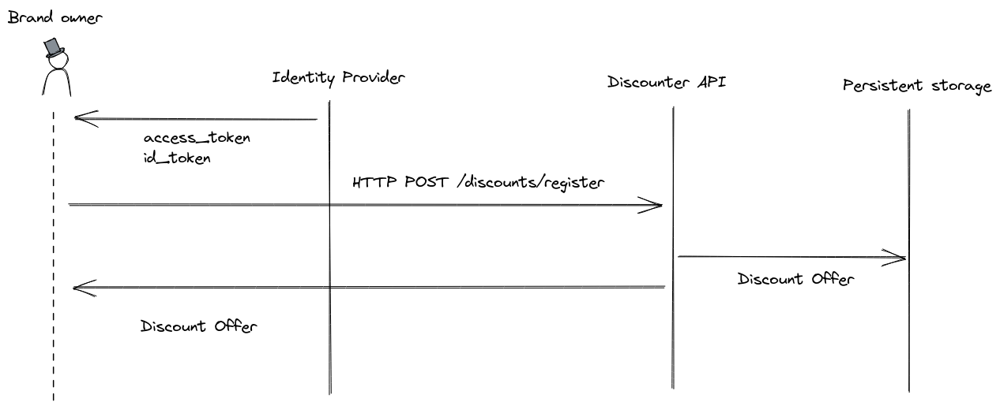
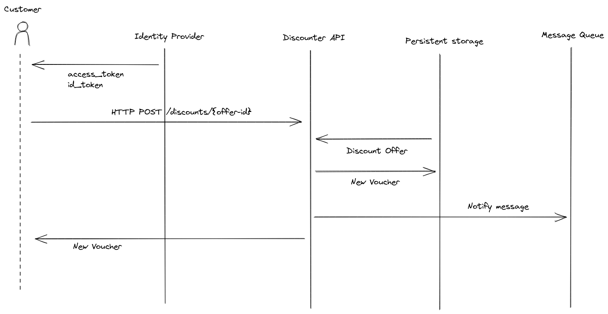
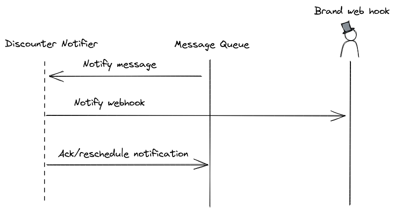

# User stories

## As a brand I want to have discount codes generated for me so that I don't have to deal with this administration myself.

A brand owner identifies themselves using OpenID Connect or an alternative method, providing both authentication and authorization for the service. The owner will then be able to generate a `Campaign` by calling an API to the `Discount` service, providing the following JSON:

    {
        "amount": 10,
        "currency": "EUR",
        "voucher_expires": "yyyy-mm-ddTHH:MM:SS.ffffffZ",
        "campaign_begins": "yyyy-mm-ddTHH:MM:SS.ffffffZ",
        "campaign_ends": "yyyy-mm-ddTHH:MM:SS.ffffffZ",
        "max_issued": 5000
    }

The API returns a `Campaign identifer` that the brand owner can use to generate a `Voucher`.

---

## As a logged in user, I want to be able to get a discount code so that I can get a discount on a purchase.

A customer identifies themselves either with OpenID Connect or an alternative method, providing authentication and authorization for the service. The user will be able request a `Voucher` by using the `Campaign identifier` provided by the brand.

---

## As a brand, I want to be notified about a user getting a discount code so that I can process information about the user for my loyalty programme.

A brand owner identifies themselves using OpenID Connect or an alternative method, providing both authentication and authorization for the service. The brand owner should be to allowed to register a webhook for the application.

The service listens to the message queue, and identifies the corresponding webhook and calls it. Should the request fail, the task will be rescheduled until a freshness value has been exceeded.

---

### Future Work
* Consider limiting the voucher to distinct categories of wares.
* Consider limiting the number of times a single user can claim a voucher
* Consider if the authentication method for the Voucher request is to constraining for integration
* Consider replacing the `VolatileStorage` with a more suitable data storage, that preferably supports transactions.
* Consider adding a registration endpoint for brand owners to add webhooks for their campaigns.
* Consider implementing the notification service as a separate daemon process that consumes messages from the message queue.